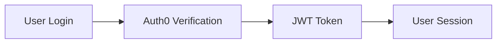
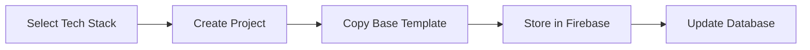
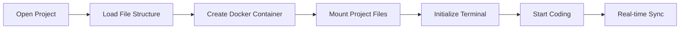
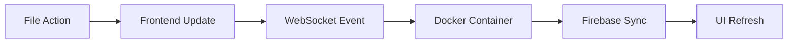

# 🚀 CodeLabs - Cloud-Based IDE in your browser

</u><b><a href="https://code-labs.tech" target="_blank">🔗<u>code-labs.tech</u></a></b>

A modern, full-stack cloud IDE that enables developers to create, edit, and run projects directly in the browser with real-time containerized execution environments.

## ✨ Features

- **Multi-Project Support** - Create projects with different tech stacks or frameworks (React, Node.js, Express, Next.js)
- **File Management** - Complete file explorer with create, rename, delete operations
- **Integrated Code Editor** - Powerful code edior that sync with cloud in real-time
- **Browser Terminal** - Full terminal access with Docker containerization
- **AI Chat Bot** - Integrated AI chat bot powered by Gemini for coding queries
- **Authentication** - Secure login with Auth0 auth library
- **Cloud Storage** - Projects stored in Google Firebase Cloud Storage
- **Real-time Connection** - WebSockets for real-time persistent connection with the server
- **Project Live Preview** - Currently in development, will allow users to preview their projects live in the browser

## 🛠️ Tech Stack

### Frontend

-  **React 18** - UI framework
-  **TypeScript** - Type safety
-  **Vite** - Build tool
-  **Tailwind CSS** - Styling
-  **Socket.IO Client** - Real-time communication

### Backend

-  **Node.js** - Runtime environment
-  **Express.js** - Web framework
-  **Socket.IO** - WebSocket server
-  **Docker** - Containerization
-  **TypeScript** - Type safety

### Database & Storage

-  **MongoDB** - Database
-  **Firebase Storage** - File storage

### AI Integration
-  **Gemini API** - AI chat bot for coding queries
-  **Large Language Model** - gemini-2.5-flash


### Authentication & Deployment

-  **Auth0** - Authentication
-  **Microsoft Azure** - Virtual Machine (VM)
-  **GitHub Actions** - CI/CD

## 🔄 Application Flow

#### 1. **User Authentication**



#### 2. **Project Creation**



#### 3. **IDE Workflow**



#### 4. **File Operations**



## 🚀 Getting Started

### Prerequisites

- Node.js
- Docker
- MongoDB
- Firebase account
- Auth0 account

### Installation

1. **Clone the repository**

```bash
git clone <repository-url>
cd codelabs
```

2. **Setup Backend**

```bash
cd back-end
npm install
```

3. **Setup Frontend**

```bash
cd front-end
npm install
```

4. **Configure Environment Variables**

```bash
# Back-end (.env)
PORT=5000
MONGODB_URI=mongod://127.0.0.1:27017
AUTH0_DOMAIN=#
## Firebase Secrets
apiKey=#
authDomain=#
projectId=#
storageBucket=#
messagingSenderId=#
appId=#
measurementId=#

GEMINI_API_KEY=#

## Add your Firebase service account JSON as fb_secrets.json in config inside back-end/src/config

# Frontend (.env)
VITE_SERVER_URL=http://localhost:5000
VITE_AUTH0_DOMAIN=#
VITE_AUTH0_CLIENT_ID=#
VITE_REDIRECT_URI=http://localhost:5173/home
```

5. **Run with Docker Compose**

```bash
docker-compose up --build
```

#### Manual Development Setup

1. **Start Backend**

```bash
cd back-end
npm run dev
```

2. **Start Frontend**

```bash
cd front-end
npm run dev
```

## 🌐 Connect
- ##### LinkedIn: [Aman Tiwari](https://www.linkedin.com/in/aman-tiwari001/)
- ##### X: [@aman_tiwari001](https://x.com/aman_tiwari100)
- ##### Email: <a href="mailto:amananjalitiwari2007@gmail.com">amananjalitiwari2007@gmail.com</a>

---
**Built with ❤️‍🔥 by Aman Tiwari**
